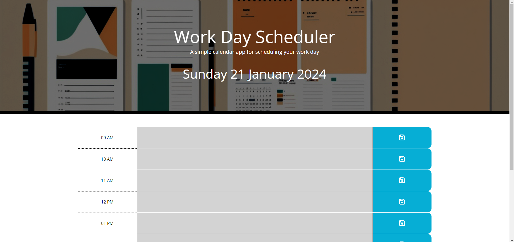
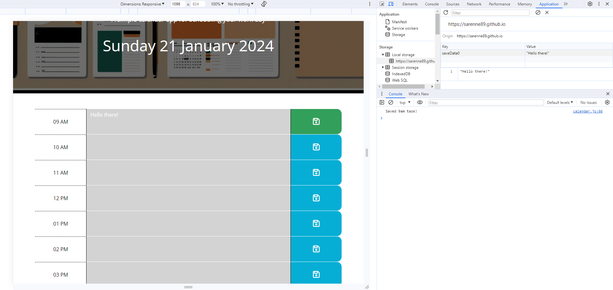

# Planner-App

Week 7 Challenge - Third Party APIs

## Description

In this weeks challenge, we have been tasked with creating a daily planner app that includes the current date and various different time slots. These time slots can have data enterred in them, which can be saved and later retrieved on page refresh. The time slots will also change their styling depending on the time of day to give some visual cues to the user.
This challenge includes use of Bootstrap, JQuery and dayjs().

## Installation

Visit https://sarenne89.github.io/Planner-App in your browser.

## Usage

## Credits

edX Bootcamp instructors

## License

MIT License

---

© 2024 edX Boot Camps LLC. Confidential and Proprietary. All Rights Reserved.

## Features

A series of questions and answers giving a high score at the end of the quiz.

## Tests

Code can be inspected via the Google Chrome 'Inspect' option and selecting the console when opening the HTML file.
